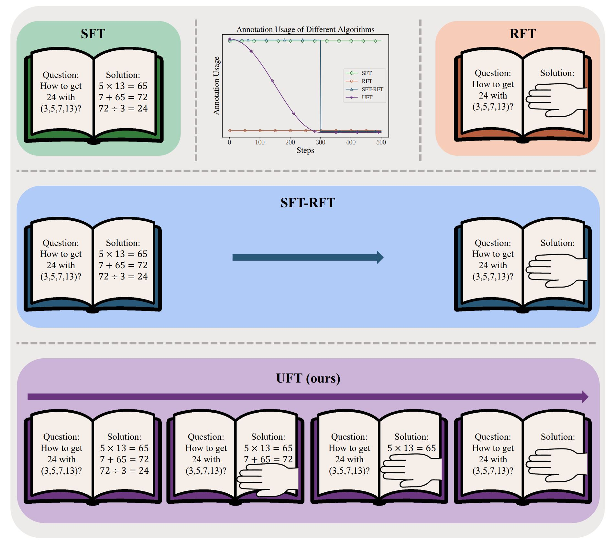
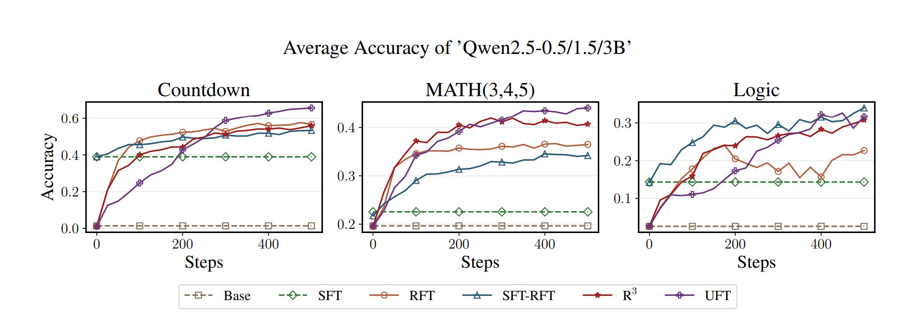
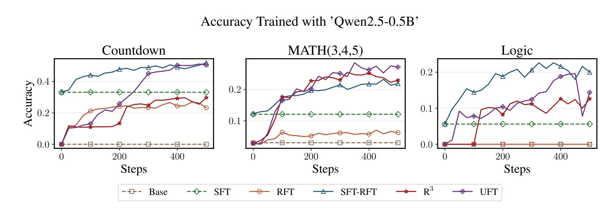
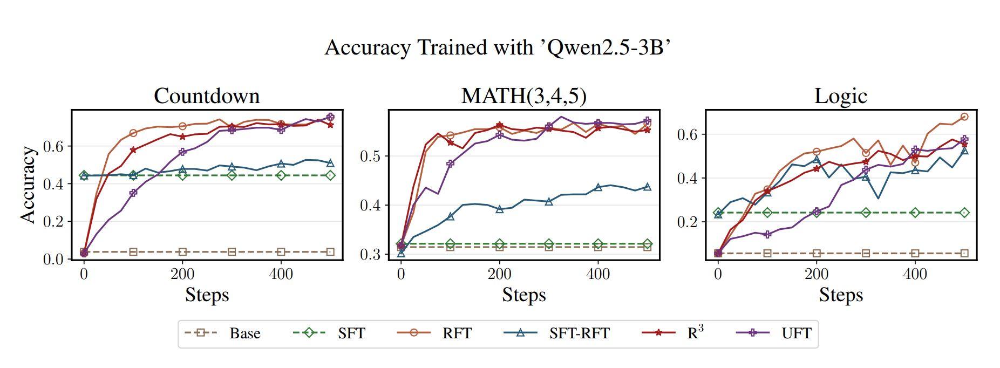

<div align="center">

# UFT: Unifying Supervised and Reinforcement Fine-Tuning

[Mingyang Liu](https://liumy.netlify.app/), [Gabriele Farina](https://www.mit.edu/~gfarina/about/), [Asuman Ozdaglar](https://asu.mit.edu/)

[](https://arxiv.org/abs/2505.16984) [](https://huggingface.co/collections/liumy2010/uft-682e0b86a37875d384cfbb73)

<div align="center" style="font-family: Arial, sans-serif;">
  <p>
    <a href="#results" style="text-decoration: none; font-weight: bold;">📊 Results</a> •
    <a href="#installation" style="text-decoration: none; font-weight: bold;">🛠️ Installation</a>
  </p>
  <p>
    <a href="#usage" style="text-decoration: none; font-weight: bold;">⚙️ Usage </a> •
    <a href="#acknowledgement" style="text-decoration: none; font-weight: bold;">🌻 Acknowledgement</a> •
    <a href="#citation" style="text-decoration: none; font-weight: bold;">📝 Citation</a>
  </p>
</div>

</div>

## Results

### Accuracy of different algorithms averaged over `Qwen2.5-0.5/1.5/3B`


### Accuracy of different algorithms on `Qwen2.5-0.5B`


### Accuracy of different algorithms on `Qwen2.5-3B`


## Installation

```
conda create -n uft python=3.9
conda activate uft
bash install.sh
```

## Usage

### Training

```
python run.py
  --algo              Algorithm to use: {sft, rft, stage, r3, uft}
  --n_gpu             Number of GPUs
  --visible-devices   GPU index to use, e.g., "0,1,2,3"
  --T                 Total training steps (default: 500)
  --T_hint            Maximum training steps with hint (default: 300)
  --data              Dataset: {countdown,math,kk_logic,others}
  --model             Model name (e.g., Qwen2.5-1.5B)
  --tp_size           
  --eval              Triggered to evaluate the model, otherwise training
  --idx IDX           Index of the current process (default=0)
  --sft_loss_coef     Coefficient for the additional log-likelihood term on hint
  --n_rollout        Number of trajectory rollouts (default 4)
```

#### Example 
`python run.py --model Qwen/Qwen2.5-1.5B --data countdown`

#### Requirement
- `Qwen2.5-0.5/1.5B` and `Llama-3.2-1B`: 2 `H100`
- `Qwen2.5-3B` and `Llama-3.2-3B`: 4 `H100`

`Qwen2.5-0.5/1.5B` / `Llama-3.2-1B` can be trained with 1 `H100` by setting `n_rollouts=2`

### Evaluate

Change `model` and `dataset` to the the model name (*e.g.*, `Qwen/Qwen2.5-1.5B`) and dataset name (*e.g.*, `countdown`) to evaluate
```
python run.py --model {model} --data {dataset} --eval
```

## Acknowledgement
* The experiments are based on [VERL](https://github.com/volcengine/verl) and [TinyZero](https://github.com/Jiayi-Pan/TinyZero).
* We use [Qwen2.5](https://github.com/QwenLM/Qwen2.5) and [Llama3.2](https://github.com/meta-llama/llama3) series base models.
* We use some of the evaluation code from [Dr.GRPO](https://github.com/sail-sg/understand-r1-zero)

## Citation
```
@article{UFT,
author       = {Liu, Mingyang and Farina, Gabriele and Ozdaglar, Asuman},
title        = {UFT: Unifying Supervised and Reinforcement Fine-Tuning},
journal      = {arXiv preprint arXiv:2505.16984},
year         = {2025}
}
```
